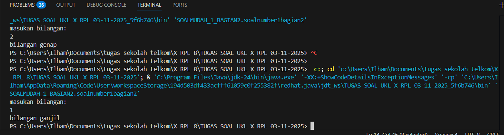

💻 Program Menentukan Bilangan Ganjil atau Genap

📘 Deskripsi

Program ini dibuat untuk menentukan apakah suatu bilangan yang dimasukkan oleh pengguna merupakan bilangan ganjil atau genap.
Program menggunakan bahasa Java dan memanfaatkan kelas Scanner untuk membaca input dari pengguna melalui keyboard.

⚙️ Cara Kerja Program

Pengguna diminta untuk memasukkan sebuah bilangan.

Program akan memeriksa apakah bilangan tersebut habis dibagi 2 menggunakan operator modulus (%).

Jika hasilnya 0, maka bilangan tersebut genap.
Jika tidak, maka bilangan tersebut ganjil.

Hasil ditampilkan di layar.

🧩 Kode Program
package SOALMUDAH_1_BAGIAN2;
import java.util.Scanner;

public class soalnumber1bagian2 {
    public static void main(String[] args) {
        Scanner input = new Scanner(System.in);

        double bilangan; 
        System.out.println("masukan bilangan: ");
        bilangan = input.nextDouble();

        if (bilangan % 2 == 0) {
            System.out.println("bilangan genap");
        } else {
            System.out.println("bilangan ganjil");
        }
    }
}

## 💻 Screenshot Output
